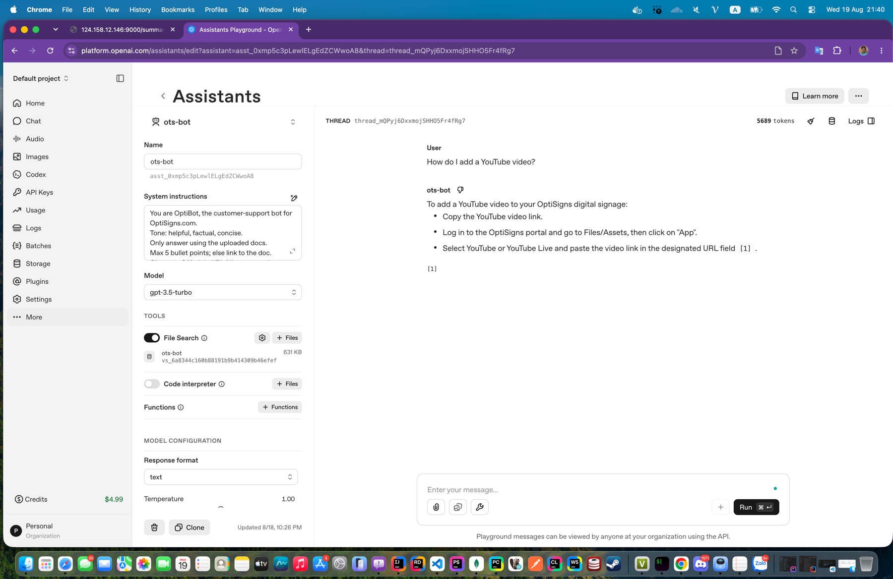

# Overview
This is an test application will scrape XXX support articles through the Zendesk API, converts them to Markdown, detects content changes, and uploads only added or updated files to an OpenAI Vector Store.
## Run Locally
Requirements:
- Python 3.12+
- OpenAI API key
- OpenAI Vector Store ID
Create the environment file:
```bash
cp .env.sample .env
```
Configure `.env`:
```env
ZENDESK_BASE_URL=articles_support_domain
ZENDESK_LOCALE=en-us
ARTICLE_LIMIT=30
ARTICLES_DIR=articles
STATE_FILE=data/storage.json
LOG_FILE=logs/app.log
SUMMARY_LOG_FILE=logs/summary.log
OPENAI_UPLOAD=0
OPENAI_API_KEY=your-api-key
OPENAI_VECTOR_STORE_ID=your-vector-store-id
```
Install dependencies and run:
```bash
python -m venv .venv
source .venv/bin/activate
pip install -r requirements.txt
python main.py
```
Set `OPENAI_UPLOAD=0` to run only the scraper without uploading files.
## Run with Docker
Build and run the sync job:
```bash
docker compose build sync
docker compose run --rm sync
```
Start the Nginx log server:
```bash
docker compose up -d log-server
```
After changing only `.env`, run:
```bash
docker compose run --rm sync
```
After changing Python code or dependencies, rebuild and run:
```bash
docker compose run --rm --build sync
```
The sync container runs once and exits. The server cron job executes it daily.
## Chunking Strategy
I did not have previous hands-on experience with Vector Store chunking, so based on my research, I chose the default OpenAI File Search strategy:
- Maximum chunk size: 800 tokens
- Chunk overlap: 400 tokens
OpenAI automatically chunks, embeds, and indexes each Markdown file. The overlap helps preserve context between adjacent chunks. This default strategy is sufficient for the scope of this test.
## Daily Job Logs
The cron job runs every day at 5:00 AM UTC. You can check the logs here:
- [Application log](http://124.158.12.146:9000/app.log)
- [Summary log](http://124.158.12.146:9000/summary.log)
## Assistant Test Result
Test question:
> How do I add a YouTube video?
